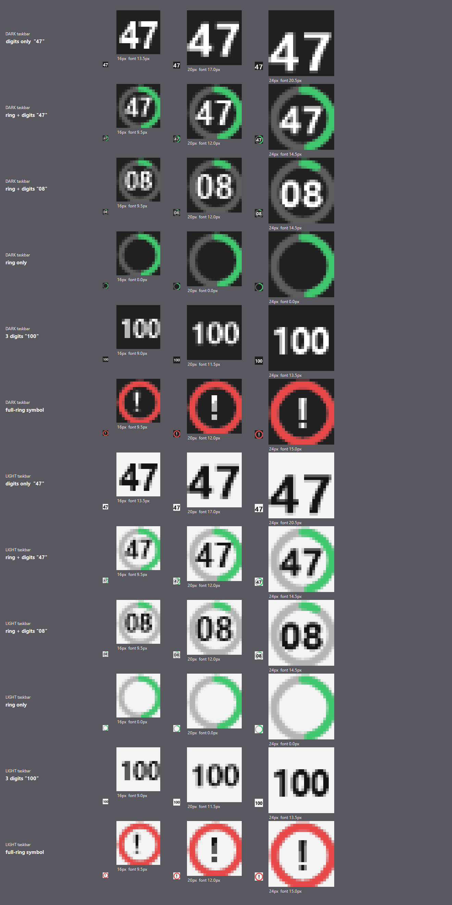

# Finding: tray icon legibility spike

**Run:** 2026-07-20 · **Machine:** Windows 11 Pro 26200 · .NET SDK 10.0.302
**Resolves:** open question *"Are 2 digits legible at 16×16 px?"* from the [ADR index](../adr/README.md)

Each design rendered at 16/20/24 px on both dark and light taskbar colours, shown 1:1 and at 8× nearest-neighbour magnification. Font auto-fitted to the largest size that fits the available box.

## Result: digits are legible — but the ring is what hurts them

**The spike inverted the assumption in [ADR-0003](../adr/0003-windows-tray-constraints.md).** It assumed a ring gauge *plus* digits. Measured, the ring is the problem: it consumes the outer ~25% of an already tiny canvas, forcing the font down and turning the digits to mush at 16 px.

| Design | 16 px | 20 px | 24 px |
|---|---|---|---|
| **Digits only** | **✅ crisp** (13.5 px font) | ✅ excellent (17 px) | ✅ excellent (20.5 px) |
| Ring + digits | ⚠️ mushy, marginal (9.5 px font) | ✅ good (12 px) | ✅ good (14.5 px) |
| Ring only | ✅ clean, but conveys no number | ✅ | ✅ |
| 3 digits (`100`) | ⚠️ cramped but readable (9 px) | ✅ (11.5 px) | ✅ (13.5 px) |
| Full ring + `!` symbol | ✅ unmistakable | ✅ | ✅ |

16 px is the default at 100% display scaling and therefore the case that must work. **Digits-only at 13.5 px is markedly more legible than ring-plus-digits at 9.5 px.**

## Revised icon design

> **Revised again 2026-07-21 (product direction).** The product owner requires the
> icon to carry a **% graph**, not digits alone. The implemented design adds a
> **proportional fill bar along the bottom edge** (~3 px at 16 px) under the
> digits: the bar is the graph, digits keep ~80% of the canvas, and re-rendered
> samples at 16/24 px on both themes confirmed digits remain legible with the bar
> present. This preserves the spike's core result — the *ring* remains rejected
> because it consumed the outer 25% and crushed the font; a 3 px bottom bar does
> not.

> **Digits only. No ring.** The two digits are the primary signal; **the digit colour** carries urgency (green → amber → red).

This is not a downgrade. The ring was only ever a redundant encoding of the number already displayed — dropping it buys ~40% more font size for the signal users actually read.

Colour is not the sole signal: the digits themselves state the value, satisfying the accessibility requirement in ADR-0003.

### The 100% case

Three digits at 16 px are cramped. At 100% use the **full-ring `!` symbol**, which the spike shows is unmistakable at every size — a distinct visual state for "limit reached" is more useful than squeezing in a third digit.

### Confirmed parameters

- Font **Segoe UI Bold**, auto-fitted per icon size rather than hard-coded — DPI scaling changes the canvas, so a fixed size will clip. The 8×-magnified `47` in the first sheet clipped to `4` at a hard-coded scale; this is exactly the bug auto-fitting prevents.
- `SmoothingMode.AntiAlias` + `TextRenderingHint.AntiAliasGridFit`
- Measure with `StringFormat.GenericTypographic` + `NoWrap`; default `StringFormat` wrapped `100` onto two lines
- Render at the real pixel size — never render large and downscale

## Related platform facts confirmed

- `NotifyIcon.Text` (tooltip) caps at **127 characters**, not 128. Planned tooltip is 32.
- `Bitmap.GetHicon()` → `Icon.FromHandle()` works, but **`DestroyIcon` must be called** on every refresh or the process leaks a GDI handle per update. See [ADR-0005](../adr/0005-native-tray-integration.md).

## Still open

- Not yet tested on a real taskbar at 125%/150%/175% scaling — the spike rendered canonical 16/20/24 px sizes. Verify on-device during the tray shell phase.
- High-contrast themes not covered.
